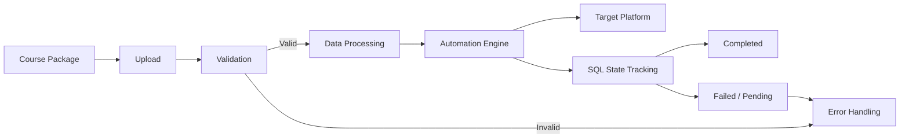
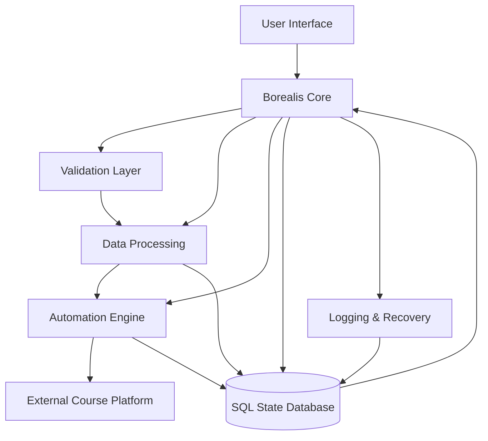
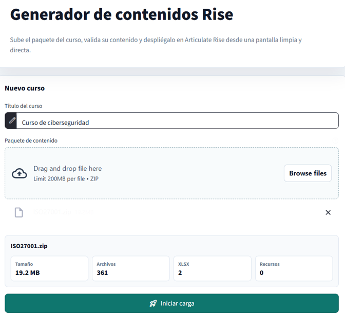
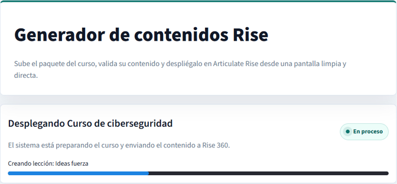
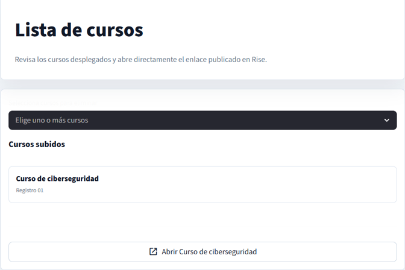
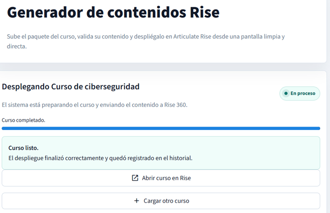
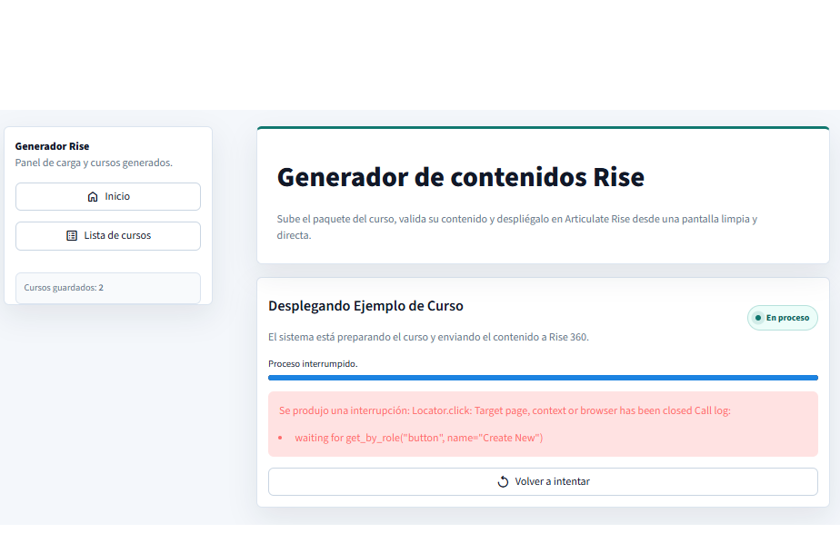

<p align="center">
  
</p>

<p align="center">
  <strong>Enterprise Course Automation System</strong>
</p>

<p align="center">
  Automated validation, deployment, tracking and batch processing for large-scale course workflows.
</p>

<p align="center">
  
  
  
  
  
</p>

<p align="center">
  
</p>

---

# Project Borealis

**Project Borealis** is a Python-based automation ecosystem designed to reduce the time, repetition and operational complexity involved in large-scale course creation and deployment.

The system combines automated validation, browser automation, structured data processing, persistent SQL state tracking and failure handling into a single controlled workflow.

What previously required extensive manual intervention can now be executed through a structured and repeatable automation pipeline.

---

## The Problem

The original workflow required repetitive manual operations for course preparation and deployment.

At scale, this introduced several problems:

- Long processing times.
- Repetitive data entry.
- Increased probability of human error.
- Limited visibility into processing state.
- Difficult recovery after interrupted operations.
- Risk of processing the same item more than once.
- Poor scalability when handling large batches.

A sufficiently large workload could require approximately **one working week** of manual processing.

---

## The Borealis Solution

Borealis transforms that workflow into an automated pipeline capable of validating data, preparing course records, interacting with the target platform and preserving execution state throughout the process.

The system was designed around three priorities:

**Automation. Reliability. Traceability.**

Instead of treating automation as a sequence of isolated scripts, Borealis behaves as a state-aware system capable of understanding what has already been processed, what is currently running and what requires attention.

---

## Key Impact

| Metric | Result |
|---|---:|
| Processing time reduction | **~98.8%** |
| Large workflow duration | **~1 week → ~20 minutes** |
| Processing throughput | **~1,000 records/hour** |
| Validation | **Automated** |
| State tracking | **SQL-backed** |
| Duplicate prevention | **Automatic** |
| Failure visibility | **Structured logging** |

> Performance figures represent internal testing and operational results obtained during development of the Borealis workflow.

---

# System Workflow



The workflow separates validation, processing, execution and state management so that failures can be identified without compromising the entire batch.

---

# System Architecture



---

# Core Features

### Automated Course Processing

Borealis automates repetitive operations involved in preparing and deploying course content, reducing the amount of manual intervention required.

### Validation Layer

Incoming course information is checked before execution so invalid or incomplete records can be detected before reaching the automation stage.

### Browser Automation

The system uses browser automation technologies such as **Selenium** and **Playwright** to perform interactions with external platforms.

### SQL State Management

Processing state is persisted in SQL, allowing Borealis to determine which records are pending, completed or affected by errors.

### Duplicate Prevention

Previously completed records can be identified before execution, preventing unnecessary or duplicated processing.

### Batch Processing

The architecture supports large groups of records rather than requiring each operation to be launched individually.

### Logging

Execution events and failures are recorded so problematic records can be identified and investigated.

### Failure Isolation

An error affecting an individual operation does not necessarily require the entire workflow to be restarted.

### Secure Configuration

Credentials and sensitive configuration are isolated from the public repository and handled through environment-based configuration.

---

# Interface

## Dashboard Overview

The main Borealis interface provides access to the primary operations of the system and acts as the control point for the automation workflow.

<p align="center">
  
</p>

---

## Course Upload

Course packages and their associated information enter the Borealis workflow through the upload interface.

This stage prepares the content before processing and validation.

<p align="center">
  
</p>

---

## Course List

Borealis provides visibility into the courses registered within the workflow, allowing processing state and available records to be reviewed from the interface.

<p align="center">
  
</p>

---

## Successful Processing

Once the automation process finishes successfully, Borealis provides confirmation of the completed workflow.

<p align="center">
  
</p>

---

# Fault Handling & Recovery

Automation systems operating against external platforms must account for unexpected states, interruptions and individual processing failures.

Borealis was designed with this in mind.

Instead of assuming every execution will succeed, the system identifies and exposes failures so they can be investigated without losing visibility into the rest of the workflow.

<p align="center">
  
</p>

This approach helps provide:

- Clear failure visibility.
- Easier debugging.
- Safer retry operations.
- Reduced risk of duplicate execution.
- Better operational traceability.

---

# Engineering Decisions

## State-Aware Automation

One of the most important design decisions in Borealis was separating automation execution from processing state.

The system does not rely exclusively on what is currently visible in the browser.

Instead, execution information is persisted independently so the system can determine what happened during previous operations.

---

## SQL-Backed Tracking

SQL provides a persistent source of truth for processing state.

This makes it possible to distinguish between records that are:

```text
PENDING
PROCESSING
COMPLETED
FAILED
```

This state model improves both reliability and recoverability.

---

## Recovery-Oriented Design

A large automated workflow should not become unusable because one record fails.

Borealis therefore focuses on isolating problematic operations and preserving enough information to understand where and why the failure occurred.

---

## Separation of Responsibilities

The architecture separates major responsibilities such as:

```text
Validation
    ↓
Data Processing
    ↓
Automation
    ↓
State Tracking
    ↓
Logging
```

This makes the project easier to maintain and allows individual components to evolve without redesigning the entire system.

---

# Technology Stack

| Technology | Role |
|---|---|
| **Python** | Core application and automation logic |
| **Selenium** | Browser automation |
| **Playwright** | Browser interaction and automation |
| **PyAutoGUI** | Desktop-level automation when required |
| **SQL** | State persistence and processing history |
| **JSON** | Structured configuration and data exchange |
| **Environment Variables** | Sensitive configuration and credentials |

---

# Manual Workflow vs Borealis

| Manual Process | Project Borealis |
|---|---|
| Repetitive manual operations | Automated execution |
| Manual validation | Automated validation |
| Limited processing visibility | State tracking |
| Manual recovery | Structured failure handling |
| Risk of duplicated work | Duplicate prevention |
| Difficult batch processing | High-volume processing |
| Up to ~1 working week | Approximately ~20 minutes |

---

# Repository Scope

Project Borealis is presented publicly as a **technical engineering case study**.

The production source code is intentionally not included in this repository.

This decision protects:

- Proprietary automation logic.
- Internal platform interactions.
- Sensitive configuration.
- Credentials.
- Production implementation details.

The purpose of this repository is to document the project's:

- Architecture.
- Engineering decisions.
- Interface.
- Workflow.
- Technologies.
- Performance improvements.
- Operational design.

---

# Source Code

```text
Public repository: Documentation / Case Study
Production code:    Private
Project status:     Functional / Internal Project
```

Borealis was developed as a real automation solution rather than as a tutorial or demonstration project.

For this reason, implementation details that could expose internal systems or proprietary logic are intentionally excluded.

---

# Why Borealis Matters

Borealis represents more than browser automation.

The project explores how automation can evolve from a simple script into a system capable of managing **state, failures, validation, persistence and large-scale execution**.

The objective was not simply to make a computer perform clicks faster.

The objective was to transform a repetitive manual workflow into a process that is:

**faster, measurable, repeatable, traceable and recoverable.**

---

# Project Status


---

# Contact

If you are interested in the architecture, automation strategy or engineering decisions behind **Project Borealis**, feel free to contact me through my GitHub profile.

---

<p align="center">
  <strong>PROJECT BOREALIS</strong>
</p>

<p align="center">
  Automation • Validation • Deployment • State Management
</p>
